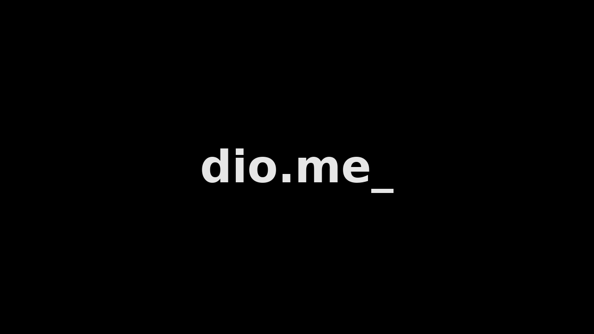

# YouTube Clone – README (HTML + CSS a partir de um layout de imagem)

Este projeto demonstra como **reconstruir uma interface do YouTube** usando apenas **HTML e CSS**, tomando como referência um **layout estático (print/Figma)**. O foco é transformar o layout em **componentes semânticos**, **grid responsivo** e **estilos reutilizáveis**, sem JavaScript.

---

## Objetivos

* Traduzir um layout de imagem para **estrutura HTML semântica**.
* Criar estilos **responsivos** e próximos do visual original.
* Praticar **organização de CSS** (tokens, layout, microestados).
* Usar **assets placeholders** para vídeo/miniaturas.

---

## Estrutura do projeto

```
youtube-clone/
├─ index.html
└─ assets/
   ├─ css/
   │  └─ style.css
   └─ images/
      ├─ logo_youtube.png
      ├─ avatar.png
      ├─ video_poster.png
      ├─ thumb1.png … thumb6.png
```

---

## Mapeamento do layout → componentes

* **Header** (fixo): menu hamburguer, logo, barra de pesquisa, ícones e avatar.
* **Player** (coluna principal): área 16:9 com poster do vídeo.
* **Metadados do vídeo**: título, canal, botão “Inscreva-se”, ações (gostei/compartilhar/download), estatísticas e descrição.
* **Sidebar** (coluna direita): lista de **sugestões** (thumbnail + texto).

---

## HTML (esqueleto semântico)

```html
<header class="site-header"> … </header>

<div class="layout">
  <main>
    <div class="player"></div>

    <div class="video-meta">
      <h1 class="video-title">Título do vídeo…</h1>

      <div class="actions-row">
        <div class="channel">
          
          <div><div class="name">DIO</div><div class="subs">83,3 mil inscritos</div></div>
          <button class="subscribe">INSCREVA-SE</button>
        </div>

        <div class="btn-group">
          <button class="btn">Gostei</button>
          <button class="btn">Compartilhar</button>
          <button class="btn">Download</button>
        </div>
      </div>

      <div class="stats">28.418 visualizações…</div>
      <div class="description">Descrição resumida…</div>
    </div>
  </main>

  <aside class="sidebar">
    <article class="suggest">
      
      <div class="s-meta">
        <div class="title">Título do vídeo</div>
        <div class="channel">DigitalInnovationOne</div>
        <div class="stats">2,1 mi • há 2 dias</div>
      </div>
    </article>
    <!-- …demais sugestões -->
  </aside>
</div>
```

---

## CSS – principais técnicas

### 1) Tokens e base

Centraliza tema e espaçamentos para fácil ajuste.

```css
:root{
  --bg:#f9f9f9; --surface:#fff; --line:#e6e6e6;
  --text:#0f0f0f; --muted:#606060; --primary:#ff0000;
  --radius:12px; --shadow:0 2px 8px rgba(0,0,0,.06);
}
*{box-sizing:border-box}
body{margin:0; font-family:system-ui, -apple-system, Segoe UI, Roboto; background:var(--bg); color:var(--text);}
```

### 2) Header fixo com busca

```css
.site-header{
  position:sticky; top:0; height:56px; display:flex; align-items:center;
  justify-content:space-between; padding:0 16px; background:var(--surface);
  border-bottom:1px solid var(--line);
}
.searchbar{display:flex; width:min(620px,80%);}
.searchbar input{flex:1; height:40px; border:1px solid var(--line); border-right:0; padding:0 12px;}
.searchbar button{width:64px; height:40px; border:1px solid var(--line); background:#f8f8f8;}
```

### 3) Layout em Grid (conteúdo + sidebar)

```css
.layout{
  max-width:1280px; margin:24px auto; padding:0 16px;
  display:grid; gap:24px; grid-template-columns:2fr 1fr;
}
@media (max-width:1000px){ .layout{ grid-template-columns:1fr } .sidebar{ order:3 } }
```

### 4) Player 16:9 e cards

```css
.player{ aspect-ratio:16/9; background:#000; border-radius:12px; overflow:hidden; box-shadow:var(--shadow); }
.suggest{ display:grid; grid-template-columns:168px 1fr; gap:8px; }
.suggest img{ width:168px; height:94px; border-radius:10px; object-fit:cover; }
```

### 5) Ações e descrição

```css
.actions-row{ display:flex; justify-content:space-between; gap:16px; flex-wrap:wrap; padding:8px 0; border-bottom:1px solid var(--line); }
.btn{ height:36px; padding:0 12px; border-radius:18px; border:1px solid var(--line); background:#f2f2f2; }
.subscribe{ background:var(--primary); color:#fff; border:0; border-radius:18px; height:36px; padding:0 14px; font-weight:600; }
.description{ background:#fff; border:1px solid var(--line); border-radius:12px; padding:12px; box-shadow:var(--shadow); }
```

---

## Responsividade & Acessibilidade

* **Responsivo:** colunas se empilham < 1000px; barra de busca oculta < 640px (como no app).
* **Semântica:** `header`, `main`, `aside`, `article`, `h1`/títulos coerentes.
* **A11y:** `alt` em imagens, `aria-label` em botões de ícone, contraste adequado.

---

## Como executar

1. Extraia o `.zip`.
2. Abra `index.html` em qualquer navegador moderno.
3. Edite `assets/css/style.css` para ajustar cores, espaçamentos e radii.

---

## Aprendizados-chave

* **Decomposição visual → HTML semântico** (antes de estilizar).
* **Grid/Flex** para replicar alinhamentos do layout.
* **Aspect-ratio** para mídia estável.
* **Tokens** aceleram retematização (tema claro/escuro, etc.).
* **Placeholders** permitem validar o layout mesmo sem conteúdo real.

> Resultado: uma base fiel ao print do YouTube, enxuta e pronta para evoluir (ex.: incorporar player real, comentários, temas, atalhos de teclado).
